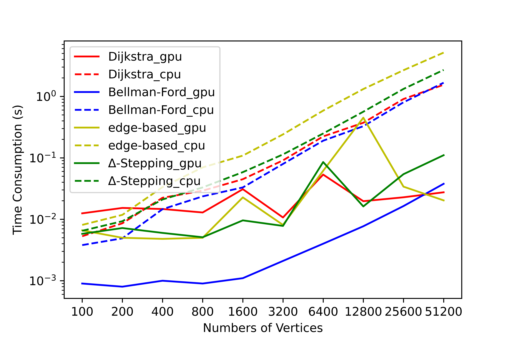
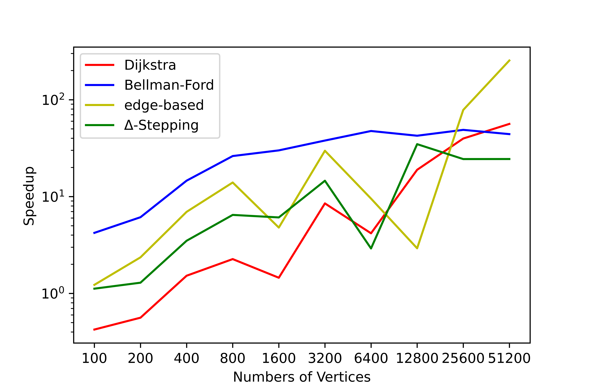
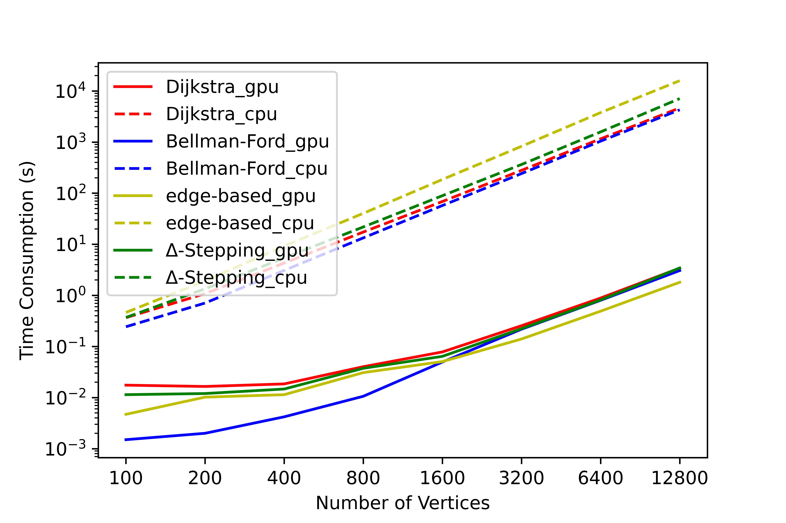
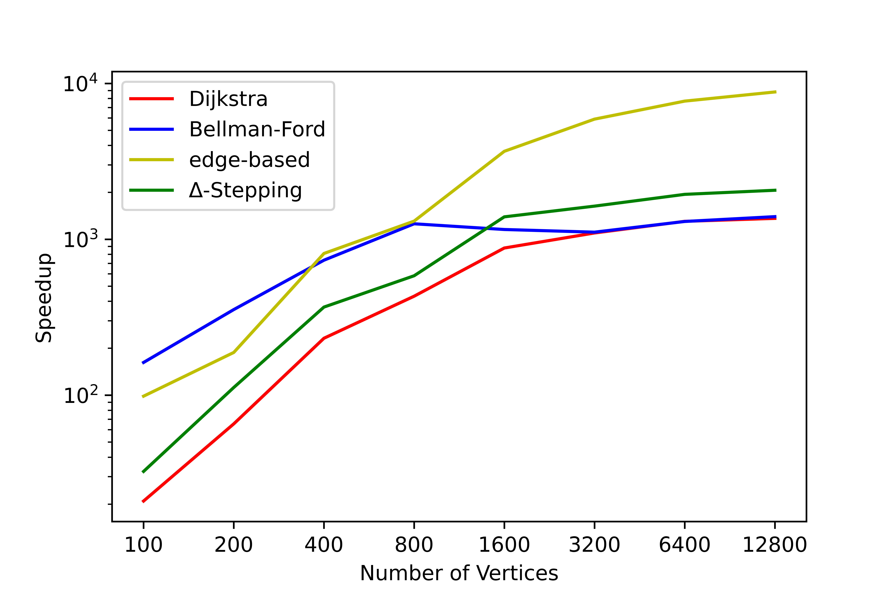

# SParry


[中文版](README.md)|[English Version](README_en.md)

## 简介

**SParry** is a shortest path calculating **Python** tool using some algorithms with **CUDA** to speedup.

It's **developing**.

------

所谓工欲善其事必先利其器。

`SParry` 是一个**最短路径计算工具包**，封装了诸如：`Dijkstra` , `Bellman-Ford` , `Delta-Stepping` ,  `Edge-Based` 等主流的最短路径算法。它也提供了**基于CUDA的并行加速版本**，以提高开发效率。

同时 `SParry` 还封装了自动分图计算方法的 `Dijkstra` 算法，可有效解决大规模图在 `GPU` 显存不足无法直接并行计算的问题。


------

## 安装

### 环境依赖

下面是开发实验中通过测试的环境。也可以参阅 [requirements.txt.](requirements.txt) 。

**Python Version**

> python3.6 
>
> python3.7

**Plantform**

> Windows
>
> Linux

Requirements

> cyaron\=\=0.4.2
> networkx\=\=2.5
> numpy\=\=1.19.4
> pycuda\=\=2019.1.2
> pynvml\=\=8.0.4

<br>

### 安装

直接下载文件包，即可在**主目录**中运行 `pretreat.py` 中的 `read()` 函数预处理数据，然后就可以放入 `calc()` 接口函数。

**目前不是发行版本，故不可pip安装，开发结构尚不是很完善。**


------

## 流程图


------

## 测试和效果

我们对此工具进行了大量的测试，在测试结果中无错误情况发生，统计了各个算法在部分图上计算**单源最短路径问题(SSSP)和全源最短路径问题(APSP)**的用时情况和串并行加速比。下面展示平均度为 4 时，各算法随结点数量变化的用时变化情况，更详细的数据请查阅 [SParry/testResult](testResult)。



<center>SSSP time consumption by degree=4</center>



<center>SSSP speedup ratio by degree=4</center>



<center>APSP time consumption by degree=4</center>



<center>APSP speedup ratio by degree=4</center>


------

## 快速入门教程

本节是帮助 `SParry` 新手快速上手的简介。同时你也可以查看[demo.py](demo.py)。

### step1. cd 到当前根目录

```powershell
cd XXX/SParry/
```


### step2. 导入计算接口

#### 内存数据-matrix

当您的图数据在**内存**中并**符合[邻接矩阵数据](tutorials.md#%E9%82%BB%E6%8E%A5%E7%9F%A9%E9%98%B5-adjacency-matrix)要求** 时，可以像下面一样导入您的数据，快速计算结果。

```python
>>> from calc import calc
>>> import numpy as np
>>> from pretreat import read
>>>
>>> matrix = np.array([[0,1,2,3],[1,0,2,3],[2,2,0,4],[3,3,4,0]], dtype = np.int32) # 邻接矩阵的数据
>>> matrix # 模拟已经拥有了一个邻接矩阵的图数据
array([[0, 1, 2, 3],
       [1, 0, 2, 3],
       [2, 2, 0, 4],
       [3, 3, 4, 0]], dtype=int32)
>>>
>>> graph = read(matrix = matrix, # 传入的数据是邻接矩阵
...              method = "dij", # 计算方法使用 Dijkstra
...              detail = True # 记录图中的详细信息
...             ) # 处理图数据
>>> # 计算的最短路径
>>> res = calc(graph = graph, # 传入图数据的类
...            useCUDA = True, # 使用 CUDA 加速
...            srclist = 0, # 设置源点为 0 号结点
...            )
>>>
>>> res.dist # 输出最短路径
array([0, 1, 2, 3], dtype=int32)
>>>
>>> print(res.display()) # 打印相关参数

[+] the number of vertices in the Graph:                n = 4,
[+] the number of edges(directed) in the Graph:         m = 16,
[+] the max edge weight in the Graph:                   MAXW = 4,
[+] the min edge weight in the Graph:                   MINW = 0,
[+] the max out degree in the Graph:                    degree(0) = 4,
[+] the min out degree in the Graph:                    degree(0) = 4,
[+] the average out degree of the Graph:                avgDegree = 4.0,
[+] the directed of the Graph:                          directed = Unknown,
[+] the method of the Graph:                            method = dij.


[+] calc the shortest path timeCost = 0.017 sec
>>>
>>> res.drawPath() # 红色的线表示此条边在最短路径上；橙色的点为源点；箭头表示边的方向；边上的数字表示边权。
```


#### 内存数据-CSR

当您的图数据在**内存**中并**符合[CSR数据](tutorials.md#%E5%8E%8B%E7%BC%A9%E9%82%BB%E6%8E%A5%E7%9F%A9%E9%98%B5-csr)要求** 时，可以像下面一样导入您的数据，快速计算结果。

```python
>>> from calc import calc
>>> import numpy as np
>>> from pretreat import read
>>>
>>> CSR = np.array([np.array([0, 2, 3, 4, 4]), 
...                 np.array([1, 2, 3, 1]), 
...                 np.array([1, 3, 4, 5])])
>>> CSR # 模拟已经拥有了CSR格式是图数据
array([array([0, 2, 3, 4, 4]), array([1, 2, 3, 1]), array([1, 3, 4, 5])],
      dtype=object)
>>>
>>> graph = read(CSR = CSR, # 传入的数据类型是 CSR
...              method = "delta", # 使用的算法为 delta-stepping
...              detail = True) # 记录图中的详细信息
>>> # 计算的最短路径
>>> res = calc(graph = graph, # 传入的图数据类
...            useCUDA = True, # 使用 CUDA 并行加速
...            srclist = 0) # 源点为 0 号结点
>>>
>>> res.dist
array([0, 1, 3, 5], dtype=int32)
>>>
>>> print(res.display()) # 打印相关参数

[+] the number of vertices in the Graph:                n = 4,
[+] the number of edges(directed) in the Graph:         m = 4,
[+] the max edge weight in the Graph:                   MAXW = 5,
[+] the min edge weight in the Graph:                   MINW = 1,
[+] the max out degree in the Graph:                    degree(0) = 2,
[+] the min out degree in the Graph:                    degree(3) = 0,
[+] the average out degree of the Graph:                avgDegree = 1.0,
[+] the directed of the Graph:                          directed = Unknown,
[+] the method of the Graph:                            method = delta.


[+] calc the shortest path timeCost = 0.007 sec
```


#### 内存数据-edgeSet

当您的图数据在**内存**中并**符合[edgeSet数据](tutorials.md#%E8%BE%B9%E9%9B%86%E6%95%B0%E7%BB%84-edgeset)要求** 时，可以像下面一样导入您的数据，快速计算结果。

```python
>>> from calc import calc
>>> import numpy as np
>>> from pretreat import read
>>>
>>> edgeSet = [[0, 0, 2, 1], # 每条边的起始点
...            [1, 3, 1, 3], # 每条边的结束点
...            [1, 2, 5, 4]] # 每条边的权值
>>>
>>> edgeSet # 模拟已经拥有了edgeSet格式是图数据
[[0, 0, 2, 1], [1, 3, 1, 3], [1, 2, 5, 4]]
>>>
>>> graph = read(edgeSet = edgeSet, # 传入的图数据是 edgeSet
...              detail = True) # 需要记录图中的数据
>>> # 计算的最短路径
>>> res = calc(graph = graph, # 传入的图数据类
...            useCUDA = False, # 使用 CPU 串行计算
...            srclist = 0) # 源点为 0 号结点
>>> res.dist 
array([         0,          1, 2139045759,          2], dtype=int32)
>>>
>>> print(res.display()) # 打印相关参数

[+] the number of vertices in the Graph:                n = 4,
[+] the number of edges(directed) in the Graph:         m = 4,
[+] the max edge weight in the Graph:                   MAXW = 5,
[+] the min edge weight in the Graph:                   MINW = 1,
[+] the max out degree in the Graph:                    degree(0) = 2,
[+] the min out degree in the Graph:                    degree(3) = 0,
[+] the average out degree of the Graph:                avgDegree = 1.0,
[+] the directed of the Graph:                          directed = Unknown,
[+] the method of the Graph:                            method = dij.


[+] calc the shortest path timeCost = 0.0 sec
```


#### 文件数据

当您的图数据存储在**文件**中并**符合数据要求时** ([文件数据](tutorials.md#%E6%96%87%E4%BB%B6%E6%A0%BC%E5%BC%8F))，您也可以传入文件来计算最短路径。

本例子中的文件如下， `test.txt` 。

```
4 6
0 1 1
0 2 2
0 3 3
1 2 2
1 3 3
2 3 4

```

代码如下：

```python
>>> from calc import calc
>>> import numpy as np
>>> from pretreat import read
>>>
>>> filename = "./data/test.txt" # 存储图数据的文件路径
>>> graph = read(filename = filename, # 传入的数据是文件
...              method = "spfa", # 使用的算法是 spfa
...              detail = True, # 记录图中的细节
...              directed = False) # 图为无向图
>>>
>>> res = calc(graph = graph, # 传入的图数据类
...            useCUDA = True, # 使用 CUDA 并行加速
...            srclist = 0) # 源点为 0 号结点
>>>
>>> res.dist # calculated shortest path
array([0, 1, 2, 3], dtype=int32)
>>>
>>> print(res.display()) # 打印相关参数

[+] the number of vertices in the Graph:                n = 4,
[+] the number of edges(directed) in the Graph:         m = 12,
[+] the max edge weight in the Graph:                   MAXW = 4,
[+] the min edge weight in the Graph:                   MINW = 1,
[+] the max out degree in the Graph:                    degree(0) = 3,
[+] the min out degree in the Graph:                    degree(0) = 3,
[+] the average out degree of the Graph:                avgDegree = 3.0,
[+] the directed of the Graph:                          directed = False,
[+] the method of the Graph:                            method = spfa.


[+] calc the shortest path timeCost = 0.002 sec
>>> res.drawPath() # 红色的线表示此条边在最短路径上；橙色的点为源点；箭头表示边的方向；边上的数字表示边权。
```


### 更多

关于伪代码请查阅这里 [pseudocode](pseudocode)。

更多信息请参阅[开发者文档](tutorials.md#%E6%8E%A5%E5%8F%A3)。

